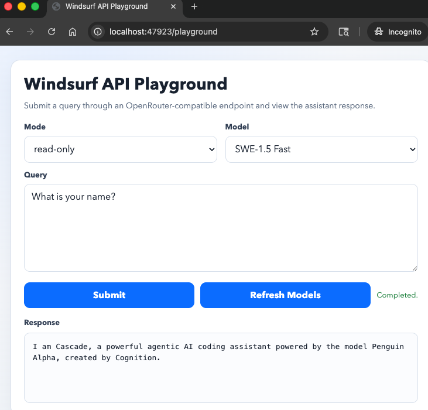
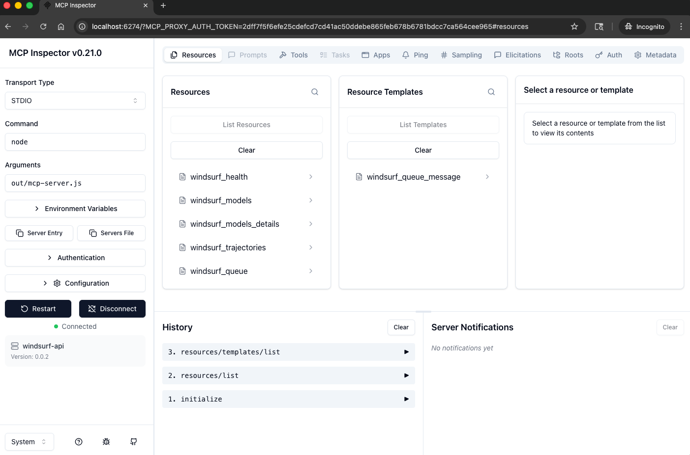

# Disclaimer

All of the actual work was done in the upstream repo this one was forked from.
See that repo for information on how it works.
This repo just has some additional features and documentation.
I am not affiliated with Codeium, Windsurf, Exafunction, or Major League Baseball.

# Usage

## Installation Scripts

### 1) Prepare project dependencies and build output

```bash
./install.sh
```

What it does:
- Checks required dependencies (`node`, `pnpm`, etc.)
- Installs project dependencies
- Generates protobuf artifacts when needed
- Compiles TypeScript
- Prints verification commands and remediation hints if runtime checks fail

### 2) Package + install extension into Windsurf

```bash
scripts/install_extension.sh
```

What it does:
- Packages the extension into a `.vsix`
- Installs it with `windsurf --install-extension`
- Verifies installation via CLI or filesystem fallback

Important:
- The script now checks that Windsurf is not running before install.
- If you intentionally need to skip that check, use:

```bash
scripts/install_extension.sh --allow-running
```

### 3) Start server inside Windsurf

In Windsurf Command Palette:
- `Windsurf API: Start Server`

### 4) Optional quick API verification

```bash
curl -fsS http://localhost:47923/models
curl -fsS -X POST http://localhost:47923/prompt \
  -H "Content-Type: application/json" \
  -d '{"text":"Hello from API"}'
```

## Settings

- `windsurfapi.port` - HTTP server port (default: 47923)
- `windsurfapi.autoStart` - Auto-start server on Windsurf init (default: false)

## API Endpoints

### POST /prompt
Send a message to Windsurf. Returns immediately with status and cascadeId.

```bash
# New conversation
curl -X POST http://localhost:47923/prompt \
  -H "Content-Type: application/json" \
  -d '{"text": "Hello from API"}'

# Continue existing conversation
curl -X POST http://localhost:47923/prompt \
  -H "Content-Type: application/json" \
  -d '{"text": "Follow-up question", "cascadeId": "cascade-id-here"}'

# With images
curl -X POST http://localhost:47923/prompt \
  -H "Content-Type: application/json" \
  -d '{
    "text": "What is in this image?",
    "images": [{"base64": "iVBORw0KGgo...", "mime": "image/png"}]
  }'

# With model selection
curl -X POST http://localhost:47923/prompt \
  -H "Content-Type: application/json" \
  -d '{"text": "Use GPT-5", "model": "GPT-5 (low reasoning)"}'

# With mode + model selection
curl -X POST http://localhost:47923/prompt \
  -H "Content-Type: application/json" \
  -d '{"text":"Plan first, then implement","mode":"planning","model":"Claude Sonnet 4.5 (promo)"}'
```

Response:
```json
{
  "status": "sent",  // or "queued" if cascade is busy
  "messageId": "message-uuid",
  "cascadeId": "cascade-uuid",
  "queuePosition": 1  // only present if queued
}
```

### GET /models
Get list of available models.

```bash
curl http://localhost:47923/models
```

Returns: `["Claude Sonnet 4.5 (promo)", "SWE-1", "GPT-5 (low reasoning)", ...]`

You can also request detailed model metadata:

```bash
curl "http://localhost:47923/models?details=1"
```

Returns:
- `count`: total number of deduped models found across model sources
- `labels`: label-only array
- `models`: full model metadata array (uid/alias/flags/pricing/provider)

### GET /trajectories
List all conversations.

```bash
curl http://localhost:47923/trajectories
```

Returns array of conversations with cascadeId, name, status, timestamps, etc.

### GET /queue
View queued messages. Optional `?cascadeId=xxx` to filter by cascade.

```bash
curl http://localhost:47923/queue
curl http://localhost:47923/queue?cascadeId=cascade-id
```

### GET /queue/:messageId
Check status of a specific message.

```bash
curl http://localhost:47923/queue/message-id
```

### GET /status?cascadeId=xxx
Check if a cascade is idle or busy.

```bash
curl http://localhost:47923/status?cascadeId=cascade-id
```

### GET /playground
Open a browser-based form UI that lets you choose mode/model, submit a query, and view the response.

```bash
open http://localhost:47923/playground
```



### OpenRouter-Compatible API

#### GET /api/v1/models
Returns model metadata in an OpenRouter/OpenAI-style `list` shape.

```bash
curl http://localhost:47923/api/v1/models
```

#### POST /api/v1/chat/completions
OpenRouter-style chat completions endpoint (non-streaming).

```bash
curl -X POST http://localhost:47923/api/v1/chat/completions \
  -H "Content-Type: application/json" \
  -d '{
    "model": "windsurf/swe-1-5",
    "mode": "read-only",
    "messages": [
      { "role": "user", "content": "Explain this codebase in 5 bullets." }
    ]
  }'
```

Notes:
- `stream: true` is not supported by this local endpoint.
- `mode` is a local extension (`default`, `read-only`, `no-tool`, `explore`, `planning`, `auto`).
- `model` accepts either model label (for example `"SWE-1.5"`) or OpenRouter-style id from `/api/v1/models`.

## CLI Query Script

Submit a prompt and wait for the final response:

```bash
scripts/query.sh --text "Summarize this repository"
```

Use mode/model flags:

```bash
scripts/query.sh \
  --mode planning \
  --model "Claude Sonnet 4.5 (promo)" \
  --text "Create a release checklist for this project"
```

Supported `--mode` values: `default`, `read-only`, `no-tool`, `explore`, `planning`, `auto`.

Other useful examples:

```bash
# Reuse an existing conversation
scripts/query.sh \
  --cascade-id "<cascade-id>" \
  --text "Continue from previous response"

# Increase timeout for slower models
scripts/query.sh \
  --model "SWE-1.5" \
  --timeout 420 \
  --text "Review this architecture and suggest tradeoffs"

# Print raw /response JSON payload too
scripts/query.sh \
  --raw \
  --text "Give a one-line summary"
```

## Test Scripts

Located in `tests/`:
- `continue.sh` - Interactive script to list and continue conversations
- `queue_test.sh` - Send 5 messages, monitor queue until empty
- `test_text.sh` - Basic text message test
- `test_image.sh` - Image message test
- `test_models.sh` - List available models
- `test_model_selection.sh` - Test sending messages with different models
- `test_trajectories.sh` - List all conversations

# Commands

- `Windsurf API: Start Server` - Start HTTP server
- `Windsurf API: Stop Server` - Stop HTTP server

# Development

## Packaging

To build a `.vsix` file:

```bash
pnpm run package
```

The GitHub Actions workflow automatically builds and releases the extension on git tags (e.g., `v0.0.2`).

## MCP Server

This repository includes a standalone MCP server that exposes the Windsurf HTTP API as MCP tools and resources. It supports `stdio` and `sse` transports.

See [mcp_server.md](mcp_server.md) for full details on setup, usage, tools, resources, and validation.



---

## Real Upstream Authors

- **[@AlexStrNik](https://github.com/AlexStrNik)** - Original author and creator
- **[@dfallon](https://github.com/dfallon)** - Maintainer and ongoing development
